# 🌍 Internet and Digital Access Across Africa (2000–2024)

> **AnalystLab Africa — Week 8 Capstone Project**

An end-to-end data analytics project exploring how internet use, mobile connectivity, fixed broadband access, and digital infrastructure have evolved across African countries between **2000 and 2024**.

The project covers the complete analytics workflow — from understanding and preprocessing the raw dataset in Python, through data validation and SQL analysis, to building an interactive Power BI dashboard and translating the results into meaningful insights and recommendations.

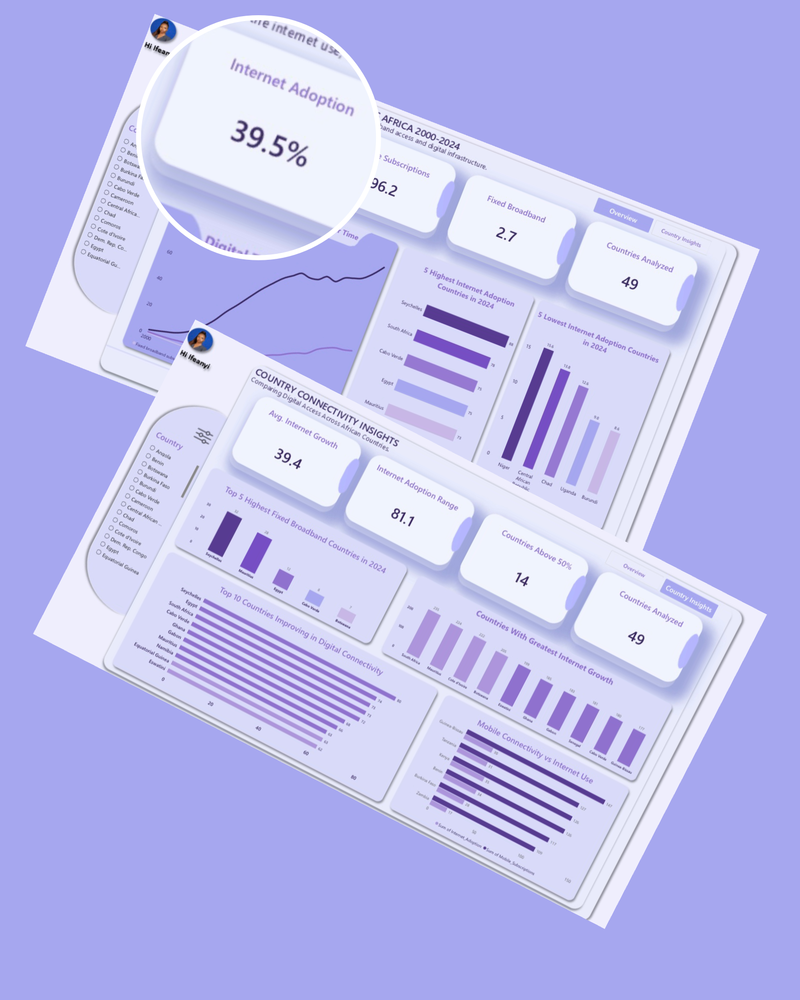


---

## 📑 Table of Contents

1. [Data Analytics Lifecycle](#-data-analytics-lifecycle)
2. [Project Overview](#-project-overview)
3. [Objective / Problem Statement](#-objective--problem-statement)
4. [Project Objectives](#-project-objectives)
5. [Dataset Description](#-dataset-description)
6. [Understanding the Dataset](#-understanding-the-dataset)
7. [Data Preparation and Cleaning](#-data-preparation-and-cleaning)
   - [Why Data Cleaning Was Necessary](#why-data-cleaning-was-necessary)
   - [Loading the Raw WDI Dataset](#loading-the-raw-wdi-dataset)
   - [Selecting the Relevant Indicators and Years](#selecting-the-relevant-indicators-and-years)
   - [Processing the Large Dataset in Chunks](#processing-the-large-dataset-in-chunks)
   - [Converting the Dataset from Wide to Long Format](#converting-the-dataset-from-wide-to-long-format)
   - [Numeric Conversion and Missing Values](#numeric-conversion-and-missing-values)
   - [Identifying African Countries](#identifying-african-countries)
   - [Filtering and Enriching the Technology Dataset](#filtering-and-enriching-the-technology-dataset)
   - [Data Coverage, Duplicate and Validation Checks](#data-coverage-duplicate-and-validation-checks)
   - [World Bank Metadata Validation](#world-bank-metadata-validation)
8. [Final Clean Dataset](#-final-clean-dataset)
9. [Analytical Methodology](#-analytical-methodology)
10. [Analytical Questions](#-analytical-questions)
11. [SQL Analysis](#-sql-analysis)
    - [Question 1](#question-1)
    - [Question 2](#question-2)
    - [Question 3](#question-3)
    - [Question 4](#question-4)
    - [Question 5](#question-5)
    - [Question 6](#question-6)
12. [DAX Measures and KPI Development](#-dax-measures-and-kpi-development)
13. [Power BI Dashboard](#-power-bi-dashboard)
14. [Dashboard Page 1 — Digital Connectivity Overview](#dashboard-page-1--digital-connectivity-overview)
15. [Dashboard Page 2 — Country Connectivity Insights](#dashboard-page-2--country-connectivity-insights)
16. [Key Findings](#-key-findings)
17. [Business and Analytical Insights](#-business-and-analytical-insights)
18. [Recommendations](#-recommendations)
19. [Limitations and Considerations](#-limitations-and-considerations)
20. [Conclusion](#-conclusion)
21. [Tools and Skills Demonstrated](#-tools-and-skills-demonstrated)
22. [Repository Structure](#-repository-structure)
23. [Author](#-author)

---

## 🔄 Data Analytics Lifecycle

This project followed a structured data analytics lifecycle from the initial understanding of the dataset through analysis, visualization, and communication of findings.

The lifecycle used for this project was:

**Ask → Prepare → Process → Analyze → Share → Act**

### 1. Ask — Define the Problem

The first stage was to understand the problem the analysis was intended to address.

The central question was:

> **How has digital connectivity evolved across African countries, and where do significant differences in digital access still exist?**

Rather than looking at only one measure of connectivity, the project considered multiple indicators:

- Internet adoption
- Mobile cellular subscriptions
- Fixed broadband subscriptions
- Secure Internet servers

The analysis was designed to investigate both **changes over time** and **differences between countries**, resulting in six analytical questions that formed the foundation of the SQL analysis and Power BI dashboard.

### 2. Prepare — Understand the Data

The next stage involved obtaining and examining the World Development Indicators (WDI) technology dataset, and understanding what each column represented, which columns identified countries and indicators, how regions were encoded, and whether the structure was suitable for analysis before any charts or queries were built.

### 3. Process — Clean and Prepare the Data

The raw dataset required preprocessing before it could be reliably analyzed. This stage focused on standardizing the dataset structure, correcting data types, converting the raw value field into a usable numeric field, handling missing values, and validating the cleaned dataset before moving to SQL and Power BI.

### 4. Analyze — Explore and Answer Questions

Once the data had been cleaned and validated, SQL was used to investigate the analytical questions through aggregation, filtering, grouping, ranking, conditional calculations, year-over-year comparisons, median calculations, and country-level comparisons.

### 5. Share — Communicate the Results

The analytical results were communicated through an interactive two-page Power BI dashboard, designed so the analytical story would be understandable to someone who had not performed the analysis themselves.

### 6. Act — Translate Findings Into Insights and Recommendations

The final stage moved beyond describing the numbers, translating the findings into recommendations around affordable internet access, broadband infrastructure, digital inclusion, mobile-to-internet conversion, and country-specific digital development strategies.

---

## 📊 Project Overview

| | |
|---|---|
| **Project Title** | Internet and Digital Access Across Africa (2000–2024) |
| **Project Type** | End-to-End Data Analytics Capstone Project |
| **Organization** | AnalystLab Africa |
| **Project Stage** | Week 8 — Final Capstone Project |
| **Analysis Period** | 2000–2024 |
| **Geographic Scope** | 49 African countries (see [Understanding the Dataset](#-understanding-the-dataset)) |

---

## 🎯 Objective / Problem Statement

Digital connectivity has expanded considerably across Africa, but the progress has not been uniform across countries or across different forms of digital infrastructure.

A country may have relatively high mobile connectivity while still having comparatively low internet adoption. Similarly, countries may experience substantial growth over time but remain significantly different from one another in terms of their current level of digital access.

The purpose of this project was therefore to analyze digital connectivity across African countries from **2000 to 2024**, identify major trends and differences, and determine what the data suggests about the state of digital access across the continent.

The analysis focused on four major indicators:

1. **Individuals using the Internet (% of population)**
2. **Mobile cellular subscriptions (per 100 people)**
3. **Fixed broadband subscriptions (per 100 people)**
4. **Secure Internet servers (per 1 million people)**

The project aimed to answer not only **"Is digital connectivity increasing?"** but also **"Where is it increasing, how much has it increased, how do countries differ, and what does that mean?"**

---

## 🎯 Project Objectives

- Examine long-term digital connectivity trends from 2000 to 2024.
- Compare internet adoption across African countries in 2024.
- Identify countries with the highest and lowest internet adoption in 2024.
- Measure the increase in internet adoption between 2000 and 2024.
- Identify countries with relatively high mobile connectivity but lower internet adoption.
- Identify the countries with the greatest overall improvement across selected digital connectivity indicators.
- Identify the countries with the highest fixed broadband subscription rates in 2024.
- Build an interactive two-page Power BI dashboard.
- Convert analytical results into actionable insights and recommendations.

---

## 🗂️ Dataset Description

The project uses data from the **World Bank World Development Indicators (WDI)**.

The project started with the raw World Bank World Development Indicators (WDI) dataset.

<div align="center">
  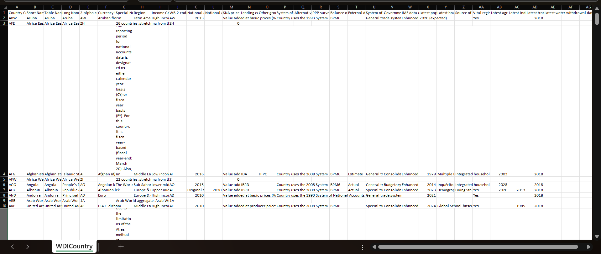
  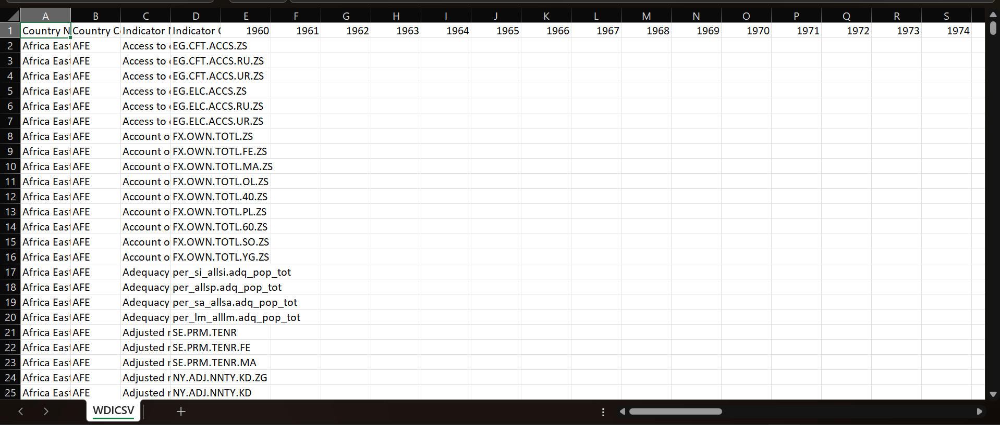
</div>

The original WDI download contains a much broader collection of countries, indicators, and years than were required for this project, so the relevant indicators and years were isolated during preprocessing rather than loading the entire dataset unnecessarily.

The original WDI technology data was supplied in a **wide format**, where each year appears as its own column:

```text
Country Name | Country Code | Indicator Name | Indicator Code | 2000 | 2001 | ... | 2024 | 2025
Country A     | XXX          | Indicator A     | CODE            | val  | val  | ... | val  | val
```

This structure is convenient for storage but not for time-series analysis or BI visualization, so the technology data was transformed into **long format** during preprocessing (see [Data Preparation and Cleaning](#-data-preparation-and-cleaning)).

### Indicators Used

| Indicator Code | Indicator | Unit |
|---|---|---|
| `IT.NET.USER.ZS` | Individuals using the Internet | % of population |
| `IT.CEL.SETS.P2` | Mobile cellular subscriptions | per 100 people |
| `IT.NET.BBND.P2` | Fixed broadband subscriptions | per 100 people |
| `IT.NET.SECR.P6` | Secure Internet servers | per 1 million people |

These indicators were selected because they capture different aspects of digital access and infrastructure — internet adoption measures actual use, mobile subscriptions measure network reach, fixed broadband measures fixed-line access, and secure servers provide an infrastructure-oriented signal. Because secure servers use a substantially different scale from the other three, it was treated separately when interpreting comparisons across indicators.

### Final Dataset Fields

| Column | Description |
|---|---|
| `CountryName` | Name of the country |
| `CountryCode` | Country's three-letter code |
| `IndicatorName` | Full name of the World Development Indicator |
| `IndicatorCode` | WDI indicator code |
| `Year` | Year of observation |
| `Value` | Numeric value of the indicator |
| `Region` | Geographic region |
| `IncomeGroup` | World Bank income classification |

---

## 🔍 Understanding the Dataset

Before cleaning the data, the dataset was examined to understand its structure and determine whether it was suitable for the intended analysis — column meaning, country and indicator coverage, year coverage, whether values were actually stored as numeric data, and whether missing or invalid values existed.

### Geographic Scope

A particularly important preprocessing decision was required because the World Bank's regional classification does not correspond perfectly with the geographic definition of Africa. The World Bank classifies most Sub-Saharan African countries under **Sub-Saharan Africa**, but **Egypt** is classified under **Middle East & North Africa**. Because Egypt is geographically an African country, it was explicitly identified and added to the country list separately, by its country code `EGY`, rather than relying on the `Region` field alone.

This produced a final analytical scope of **49 African countries**: 48 classified as Sub-Saharan Africa, plus Egypt.

---

## 🧹 Data Preparation and Cleaning

### Why Data Cleaning Was Necessary

A dashboard can look professional while still producing misleading results if the underlying data is not properly prepared. If a numerical field is stored as text, an analytical tool may fail to calculate an average, treat values incorrectly, or produce incorrect aggregations. Because the project involved calculations across thousands of country-year-indicator observations, the data needed to be standardized before analysis.

Python was used during the preprocessing stage to inspect and prepare the dataset before the analytical workflow continued. The cleaning and preprocessing workflow was implemented in Python using Pandas.

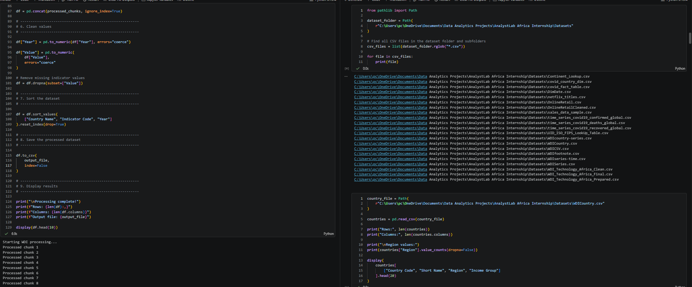

The process followed a structured sequence rather than immediately modifying the data.

### Initial Data Examination

The first step was to examine the structure, size, columns, data types, and overall contents of the dataset before applying transformations.

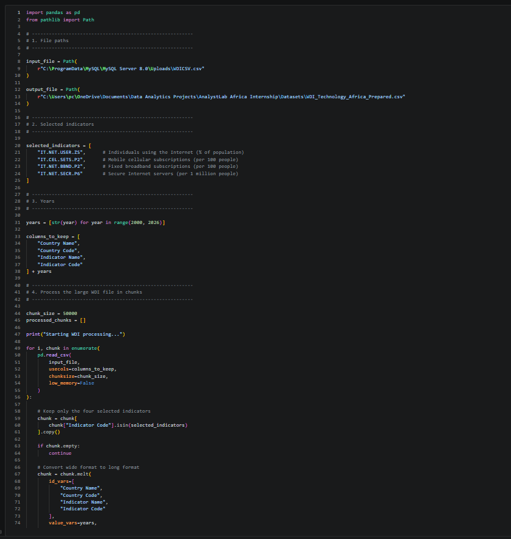

### Loading the Raw WDI Dataset

The raw WDI CSV file was loaded using Pandas. Because the dataset was large, it was processed in chunks rather than loaded entirely into memory at once, and the original file was preserved rather than overwritten by writing all output to a separate prepared file.

```python
import pandas as pd
from pathlib import Path

input_file = Path(
    r"C:\ProgramData\MySQL\MySQL Server 8.0\Uploads\WDICSV.csv"
)

output_file = Path(
    r"...\WDI_Technology_Africa_Prepared.csv"
)
```

### Selecting the Relevant Indicators and Years

Only the four required indicators were selected, using indicator codes rather than names for a standardized match against the WDI series:

```python
selected_indicators = [
    "IT.NET.USER.ZS",
    "IT.CEL.SETS.P2",
    "IT.NET.BBND.P2",
    "IT.NET.SECR.P6"
]
```

The preprocessing initially included years 2000 through 2025, so that the actual availability of 2025 data could be checked rather than assuming that 2024 was automatically the latest year:

```python
years = [str(year) for year in range(2000, 2026)]

columns_to_keep = [
    "Country Name",
    "Country Code",
    "Indicator Name",
    "Indicator Code"
] + years
```

### Processing the Large Dataset in Chunks

A chunk size of 50,000 rows was used to keep the workflow memory-efficient:

```python
chunk_size = 50000
processed_chunks = []

for i, chunk in enumerate(
    pd.read_csv(
        input_file,
        usecols=columns_to_keep,
        chunksize=chunk_size,
        low_memory=False
    )
):
    chunk = chunk[
        chunk["Indicator Code"].isin(selected_indicators)
    ].copy()

    if chunk.empty:
        continue
```

### Converting the Dataset from Wide to Long Format

Each chunk was reshaped from one column per year into `Year` and `Value` columns using `pandas.melt()`:

```python
    chunk = chunk.melt(
        id_vars=[
            "Country Name",
            "Country Code",
            "Indicator Name",
            "Indicator Code"
        ],
        value_vars=years,
        var_name="Year",
        value_name="Value"
    )

    processed_chunks.append(chunk)

df = pd.concat(processed_chunks, ignore_index=True)
```

This transformation was important because the long-format structure makes it far easier to group by year, compare indicators, filter countries, calculate averages, build time-series visualizations, and use the dataset in both SQL and Power BI.

### Numeric Conversion and Missing Values

`Year` and `Value` were both explicitly converted to numeric, using `errors="coerce"` so that anything that could not be interpreted as a number became a missing value instead of crashing the operation:

```python
df["Year"] = pd.to_numeric(df["Year"], errors="coerce")
df["Value"] = pd.to_numeric(df["Value"], errors="coerce")

df = df.dropna(subset=["Value"])

df = df.sort_values(
    ["Country Name", "Indicator Code", "Year"]
).reset_index(drop=True)

df.to_csv(output_file, index=False)
```

An important analytical decision was made here: **missing values were not converted to zero.** A missing value means an observation was not available in the source data, not that the indicator was actually zero. Treating missing data as zero could substantially distort averages, growth calculations, country rankings, and trends.

### Identifying African Countries

Country metadata was then used to identify the African countries included in the analysis.

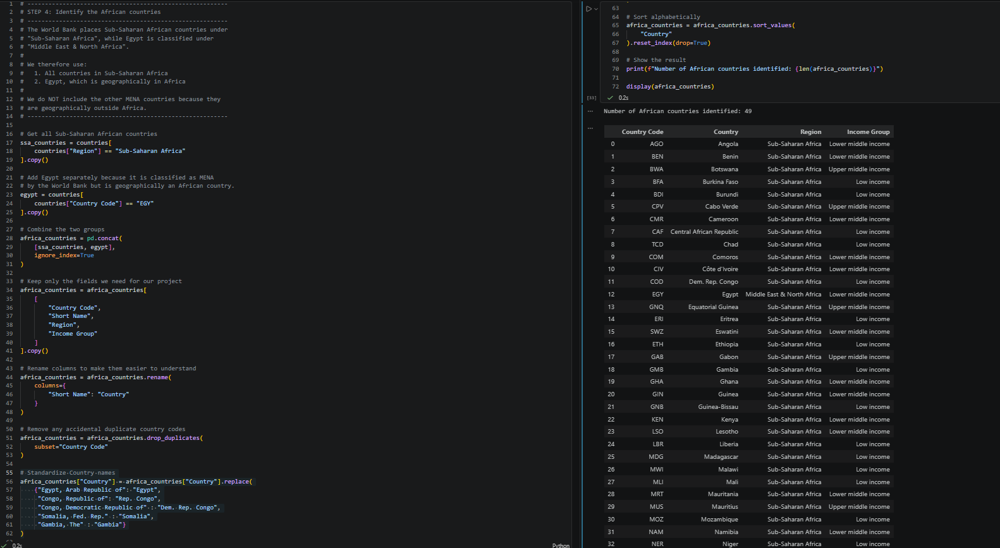

The `WDICountry.csv` metadata file was loaded, and its `Region` field was used to select all Sub-Saharan African countries. Egypt was then identified separately by its country code, since the World Bank does not classify it as Sub-Saharan Africa:

```python
ssa_countries = countries[
    countries["Region"] == "Sub-Saharan Africa"
].copy()

egypt = countries[
    countries["Country Code"] == "EGY"
].copy()

africa_countries = pd.concat(
    [ssa_countries, egypt],
    ignore_index=True
)

africa_countries = africa_countries[
    ["Country Code", "Short Name", "Region", "Income Group"]
].copy()

africa_countries = africa_countries.rename(
    columns={"Short Name": "Country"}
)

africa_countries = africa_countries.drop_duplicates(
    subset="Country Code"
)
```

This produced a verified list of **49 African countries**.

### Filtering and Enriching the Technology Dataset

The prepared technology dataset was filtered to the African country codes, then merged with the country metadata using `Country Code` rather than country name, since standardized codes are a more reliable join key than text names, which can vary in spelling or formatting:

```python
africa_technology = technology[
    technology["Country Code"].isin(
        africa_countries["Country Code"]
    )
].copy()

africa_technology = africa_technology.merge(
    africa_countries,
    on="Country Code",
    how="left"
)

unmatched = africa_technology[
    africa_technology["Country"].isna()
]
```

The unmatched-record check confirmed that every row successfully joined to a country, rather than simply assuming the merge had worked because the code executed without errors.

### Data Coverage, Duplicate and Validation Checks

Before conducting rankings or trend analysis, the dataset was checked for completeness and internal consistency.

Coverage was checked at the indicator level (records, countries, first/last year per indicator), at the country level (records and indicators per country), and by year, to identify where fewer countries had available observations:

```python
indicator_coverage = (
    africa_technology
    .groupby(["Indicator Code", "Indicator Name"])
    .agg(
        Records=("Value", "count"),
        Countries=("Country Code", "nunique"),
        First_Year=("Year", "min"),
        Last_Year=("Year", "max")
    )
    .reset_index()
)
```

Duplicates were checked using the natural key of a valid observation, **Country + Indicator + Year**, which should never repeat:

```python
duplicates = (
    africa_technology
    .groupby(["Country Code", "Indicator Code", "Year"])
    .size()
    .reset_index(name="Count")
)

duplicates = duplicates[duplicates["Count"] > 1]
```

To improve consistency and readability across the final dataset, selected World Bank country names were standardized before the dataset was saved.

This step corrected abbreviated or formal country-name variations such as `Egypt, Arab Rep.` and `Congo, Dem. Rep.` into shorter, consistent labels that are easier to interpret in SQL queries, Power BI visuals, tables, and dashboard filters.

The following transformations were applied:


• `Egypt, Arab Rep.` → `Egypt`.
• `Congo, Rep.` → `Rep. Congo`.
• `Congo, Dem. Rep.` → `Dem. Rep. Congo`.
• `Somalia, Fed. Rep.` → `Somalia`.
• `Gambia, The` → `Gambia`.

This standardization did **not** change the underlying country codes, indicator values, years, or observations. It only improved the presentation and consistency of country names while preserving the integrity of the original data.


### World Bank Metadata Validation

The project did not rely only on indicator codes. The official `WDISeries.csv` and `WDIseries-time.csv` metadata files were also loaded, to confirm the four indicators' official definitions, units, periodicity, and any World Bank notes affecting interpretation. The raw metadata contained a visible byte-order-mark artifact in its first column header, which was stripped before use:

```python
wdi_series.columns = (
    wdi_series.columns
    .str.replace("", "", regex=False)
    .str.strip()
)
```

---

## 📌 Data Quality Validation

The final dataset was validated by checking coverage, missing observations, duplicate combinations, country joins, and indicator metadata.

The final dataset was then checked to confirm that the expected country, indicator, and year combinations were present and that no unintended duplicate combinations remained.

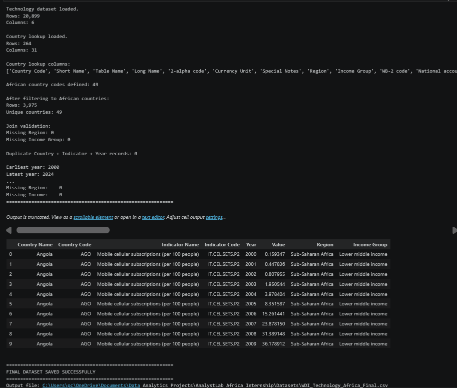

The indicator coverage in the cleaned dataset was as follows:

| Indicator | Observations |
|---|---:|
| Mobile cellular subscriptions | 1,186 |
| Individuals using the Internet | 1,174 |
| Fixed broadband subscriptions | 894 |
| Secure Internet servers | 721 |

The different observation counts matter because not every indicator has the same country-year coverage — Secure Internet servers, in particular, only begins reporting in 2010, ten years later than the other three indicators. This was considered when interpreting results and comparing indicators.

---

## 📦 Final Clean Dataset

The final cleaned dataset was structured with one observation per country, indicator, and year.

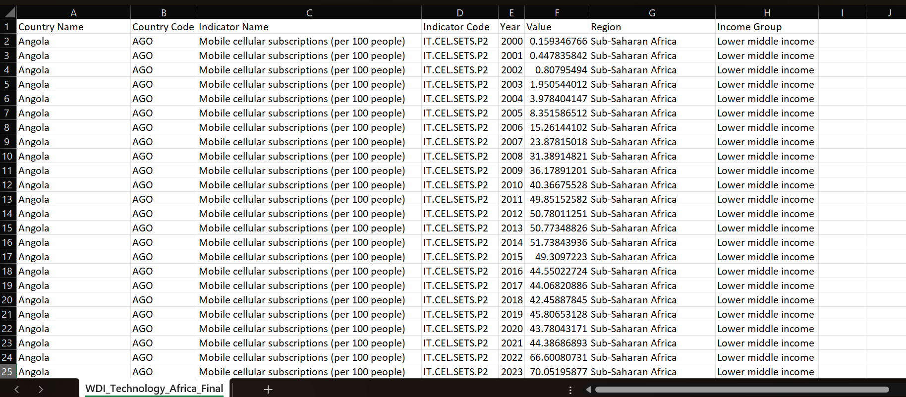

```text
CountryName
CountryCode
IndicatorName
IndicatorCode
Year
Value
Region
IncomeGroup
```

The final dataset contains **3,975 valid observations**, zero duplicate country-indicator-year combinations, and zero unmatched country joins. The analytical table used in the final SQL and Power BI model was:

**`WDI_Technology_Africa_Clean`**

---

## 🧠 Analytical Methodology

The analysis was designed around six questions. Rather than generating charts first, each question was intended to answer a specific analytical problem. The methodology combined descriptive analysis, trend analysis, comparative analysis, ranking analysis, difference analysis, median-based benchmarking, KPI calculations, and data visualization.

---

## ❓ Analytical Questions

**Q1.** How has digital technology adoption changed across African countries over time?

**Q2.** Which African countries had the highest and lowest internet adoption in 2024? *(Q2A — highest, Q2B — lowest)*

**Q3.** Which African countries experienced the largest increase in internet adoption between 2000 and 2024?

**Q4.** Which African countries have relatively high mobile connectivity but lower internet adoption?

**Q5.** Which 10 African countries experienced the greatest improvement in digital connectivity over time?

**Q6.** Which 5 African countries had the highest fixed broadband subscription rates in 2024?

---

## 🗃️ SQL Analysis

The validated dataset was imported into MySQL to perform the analytical queries.

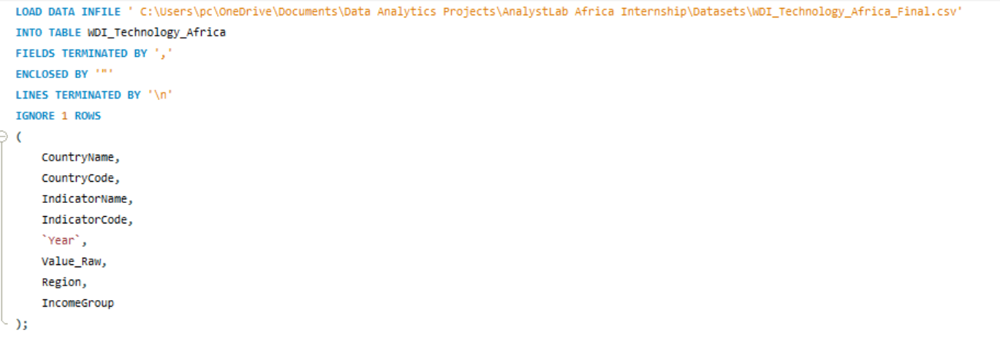

Six analytical questions were developed to investigate trends, differences, growth, infrastructure, and the relationship between mobile connectivity and internet adoption. An earlier version of these queries filtered on `Region = 'Sub-Saharan Africa'`, which unintentionally excluded Egypt from five of the six results, since Egypt is classified by the World Bank under Middle East & North Africa rather than Sub-Saharan Africa. The queries below have been corrected to run against the full 49-country cleaned dataset with no `Region` filter, so Egypt is now included consistently across all six questions.

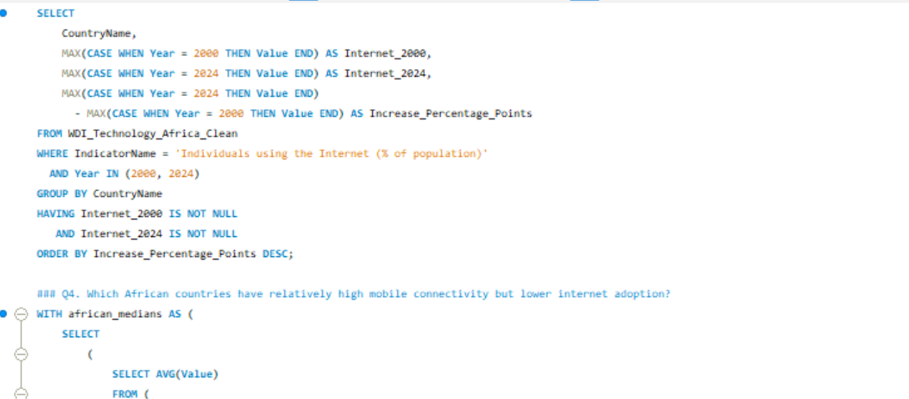

The queries produced the following results, which were then used to guide the visual analysis.

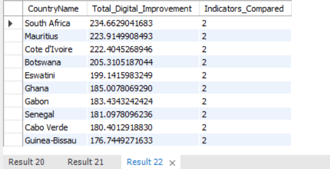

### Question 1

**How has digital technology adoption changed across African countries over time?**

```sql
SELECT
    Year,
    IndicatorName,
    AVG(Value) AS Average_Value
FROM WDI_Technology_Africa_Clean
GROUP BY Year, IndicatorName
ORDER BY Year, IndicatorName;
```

| Year | Internet Adoption | Mobile Subscriptions | Fixed Broadband | Secure Internet Servers |
|---|---:|---:|---:|---:|
| 2000 | 0.85% | 2.55 | 0.0002 | — |
| 2010 | 7.39% | 50.57 | 0.57 | 4.60 |
| 2020 | 33.12% | 88.19 | 2.11 | 1,594.08 |
| 2024 | 41.24% | 105.46 | 3.67 | 3,313.24 |

The results show a substantial increase in digital connectivity over the period analyzed. Secure Internet servers only begins reporting in 2010 and swings dramatically year to year (it peaked at 5,952.92 in 2018 before falling to 1,459.59 in 2022), which reflects a small number of countries with very high per-capita server counts skewing the average rather than a genuine region-wide surge and drop. This indicator is best read per-country, not as a continental average.

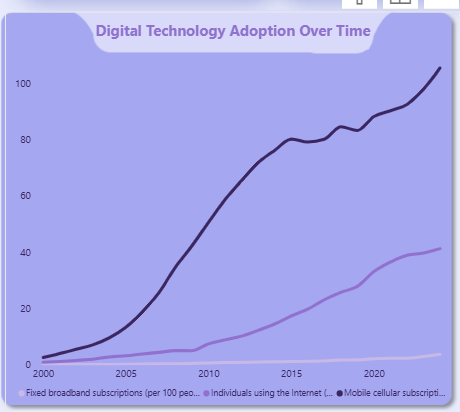

### Question 2

**Which African countries had the highest and lowest internet adoption in 2024?**

**Q2A — Highest**

```sql
SELECT CountryName, ROUND(Value, 2) AS Internet_Adoption_2024
FROM WDI_Technology_Africa_Clean
WHERE IndicatorName = 'Individuals using the Internet (% of population)'
  AND Year = 2024
ORDER BY Value DESC LIMIT 5;
```

The five countries with the highest internet adoption in 2024 were:

| Country | Internet Adoption |
|---|---:|
| Seychelles | 87.82% |
| South Africa | 78.36% |
| Cabo Verde | 74.74% |
| Egypt | 74.65% |
| Mauritius | 73.31% |

*Egypt now appears at #4. Ghana, which previously held the #5 spot under the Region-filtered version of this query, no longer makes the top 5.*

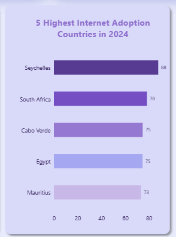

**Q2B — Lowest**

```sql
SELECT CountryName, ROUND(Value, 2) AS Internet_Adoption_2024
FROM WDI_Technology_Africa_Clean
WHERE IndicatorName = 'Individuals using the Internet (% of population)'
  AND Year = 2024
ORDER BY Value ASC LIMIT 5;
```

The five countries with the lowest internet adoption in 2024 were:

| Country | Internet Adoption |
|---|---:|
| Burundi | 8.60% |
| Uganda | 8.95% |
| Chad | 12.63% |
| Central African Republic | 13.78% |
| Niger | 15.56% |

*This result is unchanged, Egypt was never near the bottom of the distribution.*

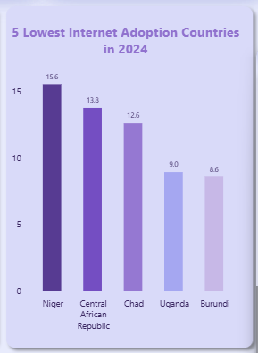

There is a very large difference between the highest and lowest observed countries — Seychelles at approximately 87.82% versus Burundi at approximately 8.60%, a gap of roughly 79 percentage points. This demonstrates that continent-level improvement does not mean that digital access is evenly distributed across countries.

### Question 3

**Which African countries experienced the largest increase in internet adoption between 2000 and 2024?**

The change was measured in **percentage points**, not percentage growth.

```sql
SELECT
    CountryName,
    MAX(CASE WHEN Year = 2000 THEN Value END) AS Internet_2000,
    MAX(CASE WHEN Year = 2024 THEN Value END) AS Internet_2024,
    MAX(CASE WHEN Year = 2024 THEN Value END)
      - MAX(CASE WHEN Year = 2000 THEN Value END) AS Increase_Percentage_Points
FROM WDI_Technology_Africa_Clean
WHERE IndicatorName = 'Individuals using the Internet (% of population)'
  AND Year IN (2000, 2024)
GROUP BY CountryName
HAVING Internet_2000 IS NOT NULL AND Internet_2024 IS NOT NULL
ORDER BY Increase_Percentage_Points DESC;
```

This query never filtered on `Region`, so its results are unchanged from before, Egypt has always been included here.

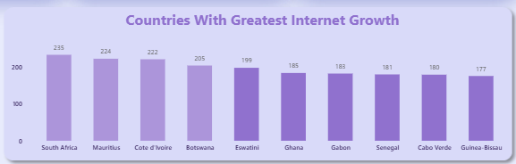

| Country | 2000 | 2024 | Increase |
|---|---:|---:|---:|
| Seychelles | 7.40% | 87.82% | 80.42 pp |
| Egypt | 0.64% | 74.65% | 74.01 pp |
| South Africa | 5.35% | 78.36% | 73.01 pp |
| Cabo Verde | 1.82% | 74.74% | 72.91 pp |
| Ghana | 0.15% | 72.18% | 72.02 pp |
| Gabon | 1.22% | 68.72% | 67.50 pp |
| Mauritius | 7.28% | 73.31% | 66.03 pp |
| Namibia | 1.64% | 64.87% | 63.23 pp |
| Equatorial Guinea | 0.13% | 63.30% | 63.17 pp |
| Eswatini | 0.93% | 63.40% | 62.48 pp |

*Full results cover all 46 countries with data at both 2000 and 2024; the table above shows the top 10.*

### Question 4

**Which African countries have relatively high mobile connectivity but lower internet adoption?**

This analysis uses the **African median** as the benchmark. With the Region filter removed, the medians shift slightly: Mobile subscriptions median ≈ **108.21** per 100 people, Internet adoption median ≈ **39.48%** (previously 36.80% under the Region-filtered version). A country qualifies when its mobile subscriptions exceed the mobile median **and** its internet adoption falls below the internet median.

```sql
WITH african_medians AS (
    SELECT
        (SELECT AVG(Value) FROM (
            SELECT Value, ROW_NUMBER() OVER (ORDER BY Value) AS rn, COUNT(*) OVER () AS cnt
            FROM WDI_Technology_Africa_Clean
            WHERE IndicatorName = 'Mobile cellular subscriptions (per 100 people)'
              AND Year = 2024
        ) AS mobile WHERE rn IN ((cnt + 1) / 2, (cnt + 2) / 2)) AS mobile_median,

        (SELECT AVG(Value) FROM (
            SELECT Value, ROW_NUMBER() OVER (ORDER BY Value) AS rn, COUNT(*) OVER () AS cnt
            FROM WDI_Technology_Africa_Clean
            WHERE IndicatorName = 'Individuals using the Internet (% of population)'
              AND Year = 2024
        ) AS internet WHERE rn IN ((cnt + 1) / 2, (cnt + 2) / 2)) AS internet_median
)
SELECT
    d.CountryName,
    MAX(CASE WHEN d.IndicatorName = 'Mobile cellular subscriptions (per 100 people)' THEN d.Value END) AS Mobile_Subscriptions,
    MAX(CASE WHEN d.IndicatorName = 'Individuals using the Internet (% of population)' THEN d.Value END) AS Internet_Adoption,
    m.mobile_median AS African_Mobile_Median,
    m.internet_median AS African_Internet_Median
FROM WDI_Technology_Africa_Clean d
CROSS JOIN african_medians m
WHERE d.Year = 2024
  AND d.IndicatorName IN (
      'Mobile cellular subscriptions (per 100 people)',
      'Individuals using the Internet (% of population)'
  )
GROUP BY d.CountryName, m.mobile_median, m.internet_median
HAVING Mobile_Subscriptions > m.mobile_median AND Internet_Adoption < m.internet_median
ORDER BY Mobile_Subscriptions DESC;
```

Even with the corrected medians, the same six countries qualify, Egypt's own profile (high internet adoption, moderate mobile subscriptions) doesn't place it in this group.

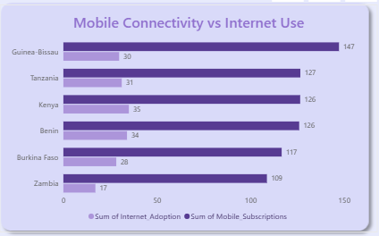

| Country | Mobile Subscriptions | Internet Adoption |
|---|---:|---:|
| Guinea-Bissau | 147.20 | 29.78% |
| Tanzania | 126.56 | 31.16% |
| Kenya | 126.48 | 34.98% |
| Benin | 125.94 | 33.98% |
| Burkina Faso | 116.59 | 28.25% |
| Zambia | 108.70 | 17.10% |

High mobile subscription levels do not automatically translate into equally high internet use. This suggests other factors may be involved, affordability, device access, digital literacy, network quality and infrastructure among them, but the data alone does not establish which factor causes the gap; it only highlights where further investigation could be valuable.

### Question 5

**Which 10 African countries experienced the greatest improvement in digital connectivity over time?**

```sql
WITH changes AS (
    SELECT
        CountryName,
        IndicatorName,
        MAX(CASE WHEN Year = 2000 THEN Value END) AS Value_2000,
        MAX(CASE WHEN Year = 2024 THEN Value END) AS Value_2024
    FROM WDI_Technology_Africa_Clean
    WHERE Year IN (2000, 2024)
    GROUP BY CountryName, IndicatorName
)
SELECT
    CountryName,
    SUM(CASE WHEN Value_2000 IS NOT NULL AND Value_2024 IS NOT NULL
        THEN Value_2024 - Value_2000 ELSE 0 END) AS Total_Digital_Improvement,
    COUNT(CASE WHEN Value_2000 IS NOT NULL AND Value_2024 IS NOT NULL THEN 1 END) AS Indicators_Compared
FROM changes
GROUP BY CountryName
HAVING Indicators_Compared > 0
ORDER BY Total_Digital_Improvement DESC
LIMIT 10;
```

Removing the Region filter changed this result more than any other query, both the improvement scores and the ranking shifted, and **Seychelles no longer appears in the top 10 at all**, despite leading every other measure of internet adoption in this project. It's replaced by Guinea-Bissau.

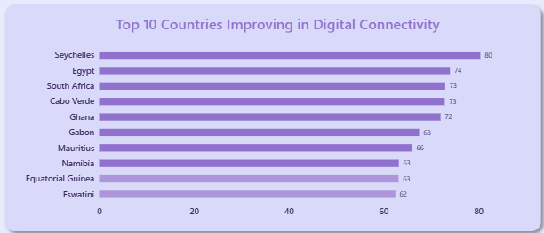

| Rank | Country | Digital Improvement Score | Indicators Compared |
|---:|---|---:|---:|
| 1 | South Africa | 234.66 | 2 |
| 2 | Mauritius | 223.91 | 2 |
| 3 | Cote d'Ivoire | 222.40 | 2 |
| 4 | Botswana | 205.31 | 2 |
| 5 | Eswatini | 199.14 | 2 |
| 6 | Ghana | 185.01 | 2 |
| 7 | Gabon | 183.43 | 2 |
| 8 | Senegal | 181.10 | 2 |
| 9 | Cabo Verde | 180.40 | 2 |
| 10 | Guinea-Bissau | 176.74 | 2 |

**Important:** this score is a project-specific composite calculated from the indicators used in this analysis. It is **not** an official World Bank "digital connectivity index," and because it sums indicators with different units, it should be read as a descriptive comparison of directional improvement, not a precise standardized ranking. Every country in this list compares the same 2 indicators, so the ranking is at least internally consistent even though it isn't an external benchmark.

### Question 6

**Which 5 African countries had the highest fixed broadband subscription rates in 2024?**

```sql
SELECT CountryName, ROUND(Value, 2) AS Fixed_Broadband_2024
FROM WDI_Technology_Africa_Clean
WHERE IndicatorName = 'Fixed broadband subscriptions (per 100 people)'
  AND Year = 2024
ORDER BY Value DESC LIMIT 5;
```

The five countries with the highest fixed broadband subscriptions in 2024 were:

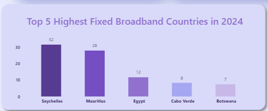

| Rank | Country | Fixed Broadband |
|---:|---|---:|
| 1 | Seychelles | 31.60 |
| 2 | Mauritius | 27.97 |
| 3 | Egypt | 11.69 |
| 4 | Cabo Verde | 8.31 |
| 5 | Botswana | 7.44 |

*Egypt now appears at #3. South Africa, which previously held the #5 spot, no longer makes the top 5.* Seychelles and Mauritius remain substantially ahead of the rest, showing that fixed broadband access is highly uneven even among the leading countries.

---

## 📐 DAX Measures and KPI Development

After the SQL analysis, Power BI was used to create calculated KPIs that summarized the dataset and provided quick context for dashboard users. The KPI strategy uses each country's most recent available observation rather than a single fixed year, since coverage varies by country and indicator, and a fixed year like 2024 would quietly undercount countries with reporting lags. Because these KPI measures were always built directly against the full cleaned table rather than a `Region`-filtered query, they were never affected by the Egypt exclusion issue described above, their values are unchanged from earlier versions of this dashboard.

### Data Model

Each of the six SQL queries above was imported into Power BI as its own table (`Question 1 WDI` through `Question 6 WDI`), rather than recalculating every ranking live inside Power BI. To let the country slicer filter consistently across all six question tables and the main fact table at once, a shared dimension table was built:

```DAX
DimCountry =
DISTINCT(
    UNION(
        SELECTCOLUMNS('WDI_Technology_Africa_Clean', "CountryName", 'WDI_Technology_Africa_Clean'[CountryName]),
        SELECTCOLUMNS('Question 2a WDI', "CountryName", 'Question 2a WDI'[CountryName]),
        SELECTCOLUMNS('Question 2b WDI', "CountryName", 'Question 2b WDI'[CountryName]),
        SELECTCOLUMNS('Question 4 WDI', "CountryName", 'Question 4 WDI'[CountryName]),
        SELECTCOLUMNS('Question 5 WDI', "CountryName", 'Question 5 WDI'[CountryName]),
        SELECTCOLUMNS('Question 6 WDI', "CountryName", 'Question 6 WDI'[CountryName])
    )
)
```

`DimCountry` sits at the center of a star schema, with a one-to-many relationship out to `WDI_Technology_Africa_Clean` and each of the six question tables, so a single country slicer filters every visual on the dashboard regardless of which table feeds it.

### Page 1 KPIs

```DAX
Internet Adoption =
AVERAGEX(
    VALUES('WDI_Technology_Africa_Clean'[CountryName]),
    CALCULATE(
        LASTNONBLANKVALUE(
            'WDI_Technology_Africa_Clean'[Year],
            SUM('WDI_Technology_Africa_Clean'[Value])
        ),
        'WDI_Technology_Africa_Clean'[IndicatorCode] = "IT.NET.USER.ZS"
    )
)
```

```DAX
Mobile Subscriptions =
AVERAGEX(
    VALUES('WDI_Technology_Africa_Clean'[CountryName]),
    CALCULATE(
        LASTNONBLANKVALUE(
            'WDI_Technology_Africa_Clean'[Year],
            SUM('WDI_Technology_Africa_Clean'[Value])
        ),
        'WDI_Technology_Africa_Clean'[IndicatorCode] = "IT.CEL.SETS.P2"
    )
)
```

```DAX
Fixed Broadband =
AVERAGEX(
    VALUES('WDI_Technology_Africa_Clean'[CountryName]),
    CALCULATE(
        LASTNONBLANKVALUE(
            'WDI_Technology_Africa_Clean'[Year],
            SUM('WDI_Technology_Africa_Clean'[Value])
        ),
        'WDI_Technology_Africa_Clean'[IndicatorCode] = "IT.NET.BBND.P2"
    )
)
```

```DAX
Countries Analyzed =
DISTINCTCOUNT('WDI_Technology_Africa_Clean'[CountryName])
```

### Page 2 KPIs

```DAX
Avg Internet Growth =
AVERAGEX(
    VALUES('WDI_Technology_Africa_Clean'[CountryName]),
    VAR StartValue =
        CALCULATE(
            MAX('WDI_Technology_Africa_Clean'[Value]),
            'WDI_Technology_Africa_Clean'[IndicatorCode] = "IT.NET.USER.ZS",
            'WDI_Technology_Africa_Clean'[Year] = 2000
        )
    VAR EndValue =
        CALCULATE(
            LASTNONBLANKVALUE(
                'WDI_Technology_Africa_Clean'[Year],
                SUM('WDI_Technology_Africa_Clean'[Value])
            ),
            'WDI_Technology_Africa_Clean'[IndicatorCode] = "IT.NET.USER.ZS"
        )
    RETURN
        IF(
            NOT ISBLANK(StartValue) && NOT ISBLANK(EndValue),
            EndValue - StartValue
        )
)
```

```DAX
Adoption Range =
VAR PerCountry =
    ADDCOLUMNS(
        VALUES('WDI_Technology_Africa_Clean'[CountryName]),
        "@Val",
            CALCULATE(
                LASTNONBLANKVALUE(
                    'WDI_Technology_Africa_Clean'[Year],
                    SUM('WDI_Technology_Africa_Clean'[Value])
                ),
                'WDI_Technology_Africa_Clean'[IndicatorCode] = "IT.NET.USER.ZS"
            )
    )
RETURN
    MAXX(PerCountry, [@Val]) - MINX(PerCountry, [@Val])
```

```DAX
Countries Above 50pct Adoption =
VAR PerCountry =
    ADDCOLUMNS(
        VALUES('WDI_Technology_Africa_Clean'[CountryName]),
        "@Val",
            CALCULATE(
                LASTNONBLANKVALUE(
                    'WDI_Technology_Africa_Clean'[Year],
                    SUM('WDI_Technology_Africa_Clean'[Value])
                ),
                'WDI_Technology_Africa_Clean'[IndicatorCode] = "IT.NET.USER.ZS"
            )
    )
RETURN
    COUNTROWS(FILTER(PerCountry, [@Val] > 50))
```

---

## 📊 Power BI Dashboard

The cleaned dataset was imported into Power BI Desktop for visualization and communication. The final report contains two pages, designed to move a viewer from a high-level overview into a deeper country-level analysis.

### Dashboard Page 1 — Digital Connectivity Overview

**Page title:** INTERNET & DIGITAL ACCESS ACROSS AFRICA 2000–2024
**Subtitle:** Overview of the internet use, mobile connectivity, broadband access and digital infrastructure.

The Overview page begins with KPI cards summarizing the current digital connectivity landscape.

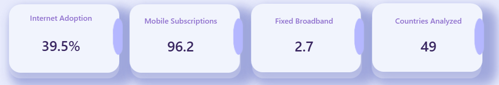

| KPI | Value |
|---|---:|
| Internet Adoption | 39.5% |
| Mobile Subscriptions | 96.2 per 100 people |
| Fixed Broadband | 2.7 per 100 people |
| Countries Analyzed | 49 |

The page also includes the Digital Technology Adoption Over Time line chart (Q1), the five highest and five lowest internet adoption countries (Q2A/Q2B, now reflecting Egypt's inclusion), a country slicer, and navigation buttons to move between Overview and Country Insights.

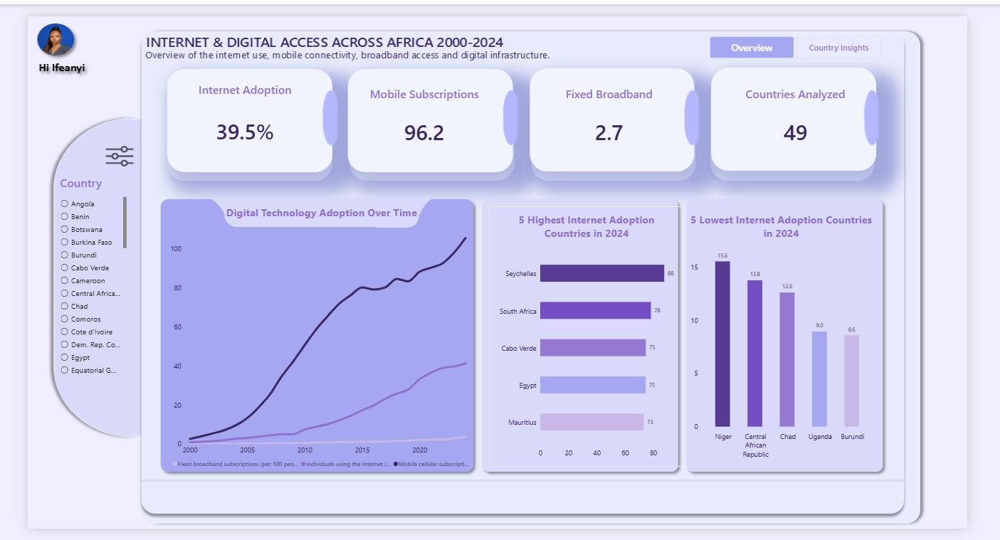

### Dashboard Page 2 — Country Connectivity Insights

**Page title:** COUNTRY CONNECTIVITY INSIGHTS
**Subtitle:** Comparing Digital Access Across African Countries

The Country Insights page retains the key KPI indicators while focusing more heavily on country-level comparisons and relationships between indicators.

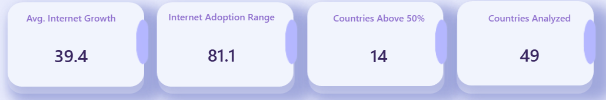

| KPI | Value |
|---|---:|
| Avg. Internet Growth (2000–2024) | 39.4 pts |
| Internet Adoption Range | 81.1 pts |
| Countries Above 50% Adoption | 14 |
| Countries Analyzed | 49 |

This page includes the Top 5 Highest Fixed Broadband Countries (Q6), Countries With Greatest Internet Growth (Q3), Top 10 Countries Improving in Digital Connectivity (Q5, now including Guinea-Bissau instead of Seychelles), Mobile Connectivity vs Internet Use (Q4), and the same country slicer for continued exploration.

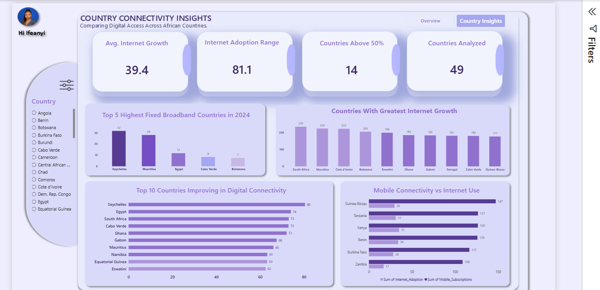

---

## 🔎 Key Findings

1. **Digital connectivity increased substantially over time.** Average internet adoption rose from 0.85% in 2000 to 41.24% in 2024.
2. **Mobile connectivity expanded faster than internet adoption.** Average mobile subscriptions rose from 2.55 to 105.46 per 100 people over the same period, considerably outpacing internet adoption's growth.
3. **Fixed broadband remained comparatively low**, rising from roughly 0.0002 to 3.67 per 100 people, real growth, but still the least developed connectivity form throughout the period.
4. **Internet adoption differs substantially between countries.** Seychelles (87.82%) versus Burundi (8.60%) is a gap of roughly 79 percentage points in 2024 alone.
5. **Seychelles led on both current level and historical growth** — highest 2024 adoption (87.82%) and the largest 2000–2024 increase (+80.42 pp).
6. **Several countries recorded major long-term growth** — Seychelles, Egypt, South Africa, Cabo Verde and Ghana all exceeded 70 percentage points of increase between 2000 and 2024.
7. **Progress was not uniform.** Some countries exceeded 70% adoption by 2024 while others remained below 20%.
8. **Mobile connectivity does not automatically translate into internet adoption.** Six countries (Guinea-Bissau, Tanzania, Kenya, Benin, Burkina Faso, Zambia) sit above the African median on mobile subscriptions but below it on internet adoption.
9. **Egypt is a strong performer once correctly included** — top 5 on both current internet adoption and fixed broadband, and #2 on 2000–2024 growth, findings that were invisible in earlier, incorrectly filtered versions of this analysis.
10. **Current adoption leadership and overall improvement are genuinely different questions.** Seychelles leads every measure of internet adoption in this project, yet does not appear in the Q5 top 10 for overall digital improvement, Guinea-Bissau does instead. A country can be the clear leader on one framing and absent from another.

---

## 💡 Business and Analytical Insights

**Insight 1 — Growth alone does not tell the full story.** "Digital connectivity is improving across Africa" is true at a broad level but incomplete; a better framing is that connectivity is improving, but the pace and level of adoption vary significantly between countries.

**Insight 2 — Mobile connectivity and internet adoption measure different things.** A country can have a large number of mobile subscriptions without a similarly high share of people actually using the internet. Possible explanations include affordability, device ownership, data costs, network quality, digital literacy, infrastructure, electricity access and income levels, the dataset identifies the pattern but does not establish which factor causes it.

**Insight 3 — Digital inequality remains significant.** The analysis shifts the conversation from "is Africa becoming more connected?" to "who is benefiting from this growth, and who is still being left behind?"

**Insight 4 — Mobile-first connectivity is important.** The large gap between mobile subscriptions and fixed broadband suggests mobile networks are the major pathway to digital access across the countries analyzed.

**Insight 5 — Infrastructure and usage should be assessed together.** Mobile subscriptions indicate network reach, fixed broadband indicates fixed-line access, internet adoption indicates actual use, and secure servers indicate infrastructure, looking at all four gives a more complete picture than relying on any one metric alone.

**Insight 6 — Scope decisions materially change results, not just row counts.** Filtering on `Region = 'Sub-Saharan Africa'` versus filtering on the actual 49-country analytical scope changed the answer to "which countries have the highest internet adoption" and "which countries lead in fixed broadband," not just the total row count. A scoping decision made in one line of SQL propagated all the way to the published dashboard.

---

## 📌 Recommendations

1. **Expand affordable internet access** — reducing cost barriers is likely to matter most in the lowest-adoption countries.
2. **Strengthen broadband infrastructure** — fixed broadband remains the least developed form of connectivity almost everywhere in the dataset.
3. **Investigate the mobile-to-internet gap directly** — in the six flagged countries, examine data affordability, smartphone ownership, network quality, digital literacy, electricity availability and household income.
4. **Use country-specific digital strategies** rather than one continent-wide plan, since countries with low adoption but strong mobile infrastructure need different interventions than countries with low adoption and weak infrastructure.
5. **Prioritize countries with persistent digital gaps** — Burundi, Uganda, Chad, Central African Republic and Niger all remained below 16% adoption in 2024 despite two decades of continent-wide growth around them.
6. **Continue monitoring digital development over time**, since connectivity changes quickly enough that a static snapshot will age out.

---

## ⚠️ Limitations and Considerations

1. **Different indicators use different units.** Internet adoption is a percentage of population, mobile and fixed broadband are per 100 people, and secure servers are per 1 million people, they are not directly comparable as raw magnitudes.
2. **Mobile subscriptions are not equivalent to unique users.** A value above 100 per 100 people reflects multiple SIM cards per person, not more than 100% of the population being connected.
3. **Correlation does not establish causation.** The mobile-versus-internet comparison identifies a pattern, not a cause.
4. **Indicator coverage varies** — Mobile subscriptions (1,186 observations), Internet users (1,174), Fixed broadband (894), and Secure Internet servers (721) do not have equal country-year coverage, and Secure Internet servers only begins reporting in 2010.
5. **Secure Internet servers is highly outlier-sensitive.** Its continental average swings by a factor of 4 between adjacent years (2018: 5,952.92, 2022: 1,459.59), driven by a small number of countries with very high per-capita counts. It's included for completeness in Q1 but should not be read as a smooth regional trend the way the other three indicators can be.
6. **No imputation was performed.** The analysis uses only the observations available in the cleaned dataset; missing years were not estimated or filled in.
7. **The Q5 digital improvement score is a descriptive composite**, not a standardized index, since it sums indicators measured in different units.

---

## 🏁 Conclusion

This project examined internet and digital access across 49 African countries between 2000 and 2024 using a complete data analytics workflow, from understanding and cleaning the raw World Bank dataset in Python, through SQL analysis of six analytical questions, to an interactive two-page Power BI dashboard.

Digital connectivity improved substantially across the countries studied, but this progress has not been uniform. Mobile connectivity expanded particularly strongly, while internet adoption and fixed broadband remain more unevenly distributed both across time and across countries. Correcting the geographic scope midway through the project, so that Egypt is consistently included rather than silently dropped by a `Region` filter, changed two of the six published rankings and reordered a third, a reminder that a single filtering decision made early in a SQL query can quietly reshape what a dashboard appears to say.

> **Digital connectivity across Africa has grown significantly, but growth does not automatically mean equal access.**

Understanding the remaining gaps requires looking beyond connectivity numbers to questions of affordability, infrastructure, digital skills, device access and other socioeconomic factors this dataset alone cannot answer.


## 🛠️ Tools and Skills Demonstrated

| Tool | Used for |
|---|---|
| **Python (Pandas)** | Data inspection, preprocessing, reshaping, numeric conversion, missing-value handling, validation |
| **SQL / MySQL** | Filtering, aggregation, grouping, ranking, conditional logic, CTEs, window functions, median calculations |
| **Power BI + DAX** | Data modeling, KPI development, interactive visualization, dashboard design, slicers, page navigation |

**Data analysis skills demonstrated:** exploratory data analysis, descriptive statistics, trend analysis, comparative analysis, ranking analysis, benchmarking, insight generation, and recommendation development.

---

## 📁 Repository Structure

```text
Internet-and-Digital-Access-Across-Africa/
│
├── README.md
│
├── data/
│   ├── WDI_Technology_Africa_Prepared.csv
│   └── WDI_Technology_Africa_Clean.csv
│
├── python/
│   └── WDI_PYTHON_PREPROCESSING.ipynb
│
├── sql/
│   └── analytical_queries.sql
│
├── powerbi/
│   └── Internet_Digital_Access_Africa.pbix
│
├── images/
│   ├── project-banner.png
│   ├── raw-dataset-preview.png
│   ├── data-inspection-python.png
│   ├── python-preprocessing-code.png
│   ├── python-country-filtering.png
│   ├── final-clean-dataset.png
│   ├── clean-dataset-validation.png
│   ├── sql-database-import.png
│   ├── sql-analysis-queries.png
│   ├── sql-query-results.png
│   ├── chart-q1-digital-adoption-over-time.png
│   ├── chart-q2-highest-internet-adoption.png
│   ├── chart-q2-lowest-internet-adoption.png
│   ├── chart-q3-internet-growth.png
│   ├── chart-q4-mobile-vs-internet.png
│   ├── chart-q5-digital-improvement.png
│   ├── chart-q6-fixed-broadband.png
│   ├── powerbi-overview-kpis.png
│   ├── powerbi-country-insights-kpis.png
│   ├── powerbi-overview.png
│   └── powerbi-country-insights.png
│
└── report/
    └── Technical_Report.docx
```

---

# 👩🏽‍💻  About Me

Hi, I'm **Ifeanyi Onyegbunam**.

I completed this project as the **AnalystLab Africa Week 8 Capstone Project**.

I'm a Data Analyst and AI Automation Specialist with a healthcare background. I enjoy transforming raw data into meaningful insights and building dashboards that help people make informed decisions.

I'm particularly interested in healthcare analytics, business intelligence and workflow automation.

---
<h2 align="center">Connect With Me</h2>

<p align="center">
  <a href="https://linkedin.com/in/ifeanyi-nwamaka">LinkedIn</a> •
  <a href="https://x.com/datababyifynix">X (Twitter)</a>
</p>

## If you found this project helpful, consider giving it a ⭐
